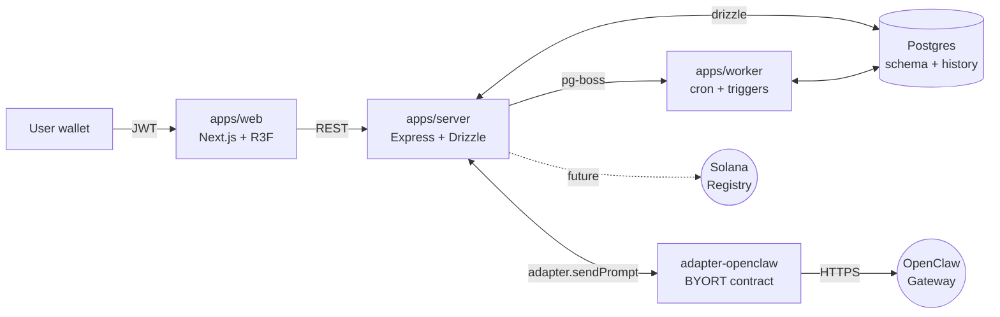
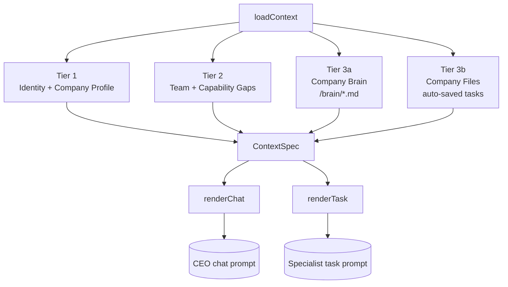

<div align="center">

# OCCA

**An operating system for AI agents.**

Stand up a hierarchical team — CEO, Heads, specialists — with persistent context, brand voice, and the ability to route work to each other.

<br />

[](#license)
[](#status)
[](https://www.typescriptlang.org/)
[](https://nextjs.org/)
[](https://www.postgresql.org/)
[](https://solana.com/)
[](https://github.com/Occa-Labs/occa-core/stargazers)

</div>

<br />

> [!WARNING]
> **Early Alpha** — APIs, schema, and behavior will change without notice. Not production-ready. On-chain layer (Solana Registry, payroll, marketplace) is whitepaper-only today.

---

## Why

Most agent setups lose what they know between turns. They re-explain who the company is, what the brand voice is, what's been shipped — every single call.

OCCA treats agents as a team that lives inside an OS. Each company has a brain (markdown files for glossary, ICP, do-don't), a team chart (CEO routes to specialists), and a queryable archive of shipped work. Context is loaded once, scoped by role, and reused across every surface.

<!--
TODO(visuals): drop a demo GIF or hero screenshot here once the OS tour
recording is ready. Suggested: 800-1000px wide, <5s loop showing the
dock → chat with CEO → CREATE_TASK → specialist working in 3D office.

-->

## Architecture



Three apps, one Postgres, one or more adapters. The chain layer is whitepaper-only today.

## Context Engineering

Single canonical `loadContext(deploymentId, surface)` returns a typed `ContextSpec`. Per-surface renderers (chat, task, future heartbeat) consume it.



| Tier   | Source                                  | Lifetime           |
| ------ | --------------------------------------- | ------------------ |
| **1**  | Identity + company profile              | Every turn         |
| **2**  | Org chart, gaps, subordinates           | Per session        |
| **3a** | Company Brain (`/brain/*.md`)           | Per company        |
| **3b** | Company Files (task deliverables)       | Persistent archive |
| **4**  | Per-agent workspace files (gateway)     | At provision       |

## Features

<table>
<tr>
<td width="50%" valign="top">

### Hierarchical agents

User talks only to the CEO. CEO routes via `CREATE_TASK` markers with `assignToRole`. Specialists can delegate, block, or escalate for review.

</td>
<td width="50%" valign="top">

### Company Brain

`/brain/*.md` per company. Glossary, ICP, do-don't, owner preferences. Visibility-scoped: CEO sees all, specialists see public only.

</td>
</tr>
<tr>
<td width="50%" valign="top">

### Company Files

Every completed task deliverable auto-saves. Tag-matched retrieval surfaces prior work into new tasks of the same type.

</td>
<td width="50%" valign="top">

### Context Engineering Pipeline

Single `loadContext` + typed `ContextSpec` + per-surface renderers. Identity and brand voice stay consistent across surfaces.

</td>
</tr>
<tr>
<td width="50%" valign="top">

### BYORT — Bring Your Own Runtime

Agent backends pluggable via the `AgentAdapter` contract. OpenClaw ships as the default. Phase 2 requires ≥2 adapters.

</td>
<td width="50%" valign="top">

### 3D OS shell

Desktop metaphor with windowed apps (Tasks, Agents, Approvals, Brain, Documents, Skills) over a 3D office scene rendered with R3F, with an image-only fallback when the licensed assets aren't present.

</td>
</tr>
</table>

## Quick start

**Prerequisites:** Node 20+, pnpm 9+, PostgreSQL 15+.

```bash
git clone https://github.com/Occa-Labs/occa-core.git
cd occa-core
pnpm install

# Configure environment
cp .env.example .env
# Fill DATABASE_URL, JWT_SECRET, PRIVY_APP_ID, PRIVY_APP_SECRET

# Create the database — migrations auto-apply on first server boot
createdb occa

# Run web (3001) + server (3002) + worker
pnpm dev
```

Open [http://localhost:3001](http://localhost:3001), connect a Solana wallet, and onboarding will walk you through deploying your first CEO.

> [!NOTE]
> The 3D office assets are licensed separately and are not bundled here, so the OS runs in **image-only mode by default** — no config needed. If you have the assets, drop them under `apps/web/public/models/` and set `NEXT_PUBLIC_ENABLE_3D_OFFICE=1` in `apps/web/.env.local` (see `apps/web/.env.example`) to render the full 3D office.

<details>
<summary><b>Available scripts</b></summary>

```bash
pnpm dev           # web + server + worker
pnpm typecheck     # pnpm -r tsc --noEmit
pnpm db:generate   # generate Drizzle migration after schema edits
pnpm db:migrate    # apply migrations manually (auto on boot otherwise)
pnpm db:studio     # open Drizzle Studio
```

No test suite yet.

</details>

## Stack

| Layer        | Tech                                              |
| ------------ | ------------------------------------------------- |
| **Frontend** | Next.js 16, React 19, R3F, TanStack Query, Zustand |
| **Backend**  | Express, Drizzle, pg-boss, Pino                    |
| **Database** | PostgreSQL 15+                                    |
| **Auth**     | Solana wallet (nonce → sign → JWT), Privy         |
| **Agents**   | BYORT contract → OpenClaw adapter (default)       |
| **Chain**    | Solana (Anchor) — whitepaper only                 |

## Repo layout

<details>
<summary><b>apps/web</b> — Next.js 16 + R3F (port 3001)</summary>

```
apps/web/src/
  app/                Next.js routes
  shell/              OS shell — dock, top bar, view-mode toggle
  features/<name>/    Vertical slices (auth, agents, tasks, company-brain, …)
  components/ui/      Leaf primitives (Button, Modal, AppWindow, …)
  lib/                api client, providers, utils
```

</details>

<details>
<summary><b>apps/server</b> — Express + Drizzle (port 3002)</summary>

```
apps/server/src/
  features/<name>/    Vertical slices (agents, chat, tasks, company-brain, …)
  services/           Cross-feature services (context pipeline, auto-save)
  infra/              database, queue, solana, privy
  middleware/         auth, logging
  routes/             Legacy spine — being migrated into features/
  lib/                Cross-cutting + constants
```

</details>

<details>
<summary><b>packages/</b> — shared code</summary>

```
packages/
  shared/             schema, types, error codes, role catalog
  runtime-core/       AgentAdapter contract
  adapter-openclaw/   OpenClaw adapter implementation
```

</details>

## Status

> **Chain = truth, DB = cache.** Every field is tagged Truth / Derived / Ephemeral. Truth fields are scheduled to live on Solana; DB is a hot cache. Today the chain layer is whitepaper-only — DB is the de-facto source.

<details open>
<summary><b>Shipped — Phase 1, partial</b></summary>

- Wallet-based auth (nonce → sign → JWT 24h)
- 3D OS shell with windowed apps
- Onboarding + post-onboarding kickoff + meeting service
- Org primitives in DB (`AgentIdentity`, `Deployment`, `RuntimeProfile`)
- BYORT adapter contract + OpenClaw adapter
- REST API + pg-boss task dispatch + cron + orphan reaper
- Agent-to-agent task delegation
- GitHub-sourced skill catalog
- **Context Engineering Pipeline (Tier 1-3b + UI)**

</details>

<details>
<summary><b>Whitepaper-only — next phases</b></summary>

- On-chain layer — Solana Registry, payroll, marketplace, escrow, reputation
- Multi-adapter — only OpenClaw registered today; §14.1 requires ≥2 for Phase 2
- Treasury authorization classes, trace anchoring
- L1/L2/L3 autonomy heartbeat ([docs/agent-autonomy.md](./docs/agent-autonomy.md))
- Agent custody models (Derived / Custodial / Threshold MPC)
- Governance multi-sig, dispute resolution

</details>

## Contributing

Contributions welcome — but the surface is moving fast. Open an issue first for anything non-trivial. PRs should pass `pnpm typecheck`.

## Acknowledgments

- **[OpenClaw](https://github.com/openclaw)** by Peter Steinberger — default agent runtime, MIT licensed third-party.
- **[Anthropic Memory Tool](https://docs.anthropic.com/)** — design inspiration for the Company Brain filesystem pattern.
- **[Letta](https://www.letta.com/), [mem0](https://mem0.ai/), [Zep](https://www.getzep.com/)** — prior art reviewed during the context layer design.

## License

TBD. Repo is public for transparency; redistribution / commercial use rights not yet granted.
